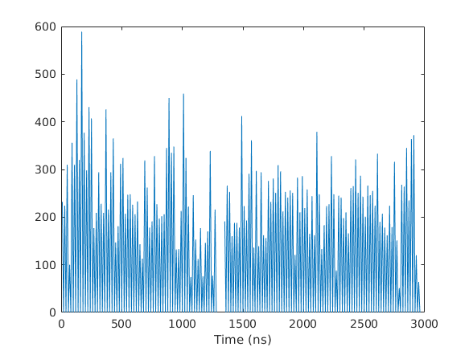

# PocketProtector
Simulate the binding of drugs to targets by identifying the shape and location of regions that may be stabilized through binding of targeted molecules, and correlate with structural changes in the protein active site or lack of drug binding stabilization. 

GoodDoc -- A Template for Simple and Clear Documentation of Bioinformatics Code!
Please cite our work -- here is the ICMJE Standard Citation:
...and a link to the DOI:
Awesome Logo
You can make a free DOI with zenodo
Website (if applicable)
Intro statement
What's the problem?
Why should we solve it?
What is ?
Overview Diagram

How to use
Software Workflow Diagram
File structure diagram
Define paths, variable names, etc
Installation options:
We provide two options for installing : Docker or directly from Github.

Testing
We tested four different tools with . They can be found in server/tools/ 

)
